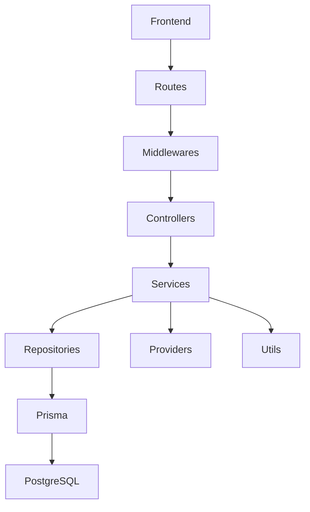

# Análise da Arquitetura do Sistema Adote Fácil

## 1. Visão Geral

O sistema Adote Fácil é estruturado em dois grandes blocos principais:

- **Frontend**: responsável pela interface com o usuário.
- **Backend**: responsável pela lógica de negócio, autenticação e acesso ao banco de dados.

A comunicação entre frontend e backend ocorre por meio de requisições HTTP, caracterizando um modelo **cliente-servidor**.

O projeto utiliza Docker para orquestração dos serviços e PostgreSQL como banco de dados.

---

## 2. Estilo Arquitetural Identificado

### 2.1 Arquitetura Cliente-Servidor

A separação explícita entre as pastas `frontend` e `backend` evidencia a adoção do modelo cliente-servidor:

- O **Frontend** atua como cliente.
- O **Backend** atua como servidor de aplicação.
- O banco de dados é executado como serviço separado (PostgreSQL).

Essa abordagem favorece escalabilidade, separação de responsabilidades e manutenção independente das camadas.

---

### 2.2 Arquitetura em Camadas (Backend)

O backend apresenta uma organização estruturada dentro da pasta `src`, com clara separação de responsabilidades:

- **routes.ts** → definição das rotas da aplicação.
- **controllers/** → recebem requisições HTTP e coordenam a execução das ações.
- **services/** → concentram as regras de negócio.
- **repositories/** → realizam acesso ao banco de dados.
- **prisma/** → ORM responsável pela comunicação com o PostgreSQL.
- **middlewares/** → interceptam requisições para autenticação e validação.
- **providers/** → implementações específicas como autenticação e criptografia.
- **utils/** → funções auxiliares reutilizáveis.
- **database.ts** → configuração de conexão com banco.
- **server.ts / app.ts** → inicialização da aplicação.

O fluxo típico de execução ocorre da seguinte forma:

1. Requisição chega ao servidor.
2. A rota correspondente é identificada.
3. O controller é acionado.
4. O service executa a regra de negócio.
5. O repository acessa o banco via Prisma.
6. A resposta é retornada ao cliente.

Essa organização caracteriza uma **arquitetura em camadas**, com forte separação entre controle, lógica de negócio e persistência.

---

### 2.3 Padrão Repository

A presença da pasta `repositories` indica a aplicação do **Repository Pattern**, cujo objetivo é abstrair o acesso ao banco de dados.

Isso reduz o acoplamento entre regras de negócio e persistência, facilitando testes e futuras mudanças de tecnologia de banco de dados.

---

## Diagrama de Componentes


### Diagrama de Pacotes
```mermaid
flowchart TD
    %% Pacote Frontend simplificado
    subgraph Frontend [📦 App Frontend / Next.js]
        direction TB
        F_Pages[Páginas / App]
        F_Comp[Componentes]
        F_API[Integração API]
        
        F_Pages --> F_Comp
        F_Comp --> F_API
    end

    %% Pacote Backend com fluxo linear (estilo que você gostou)
    subgraph Backend [📦 App Backend / Node.js]
        direction TB
        B_Routes[Routes]
        B_Middlewares[Middlewares]
        B_Controllers[Controllers]
        B_Services[Services]
        B_Repositories[Repositories]
        
        B_Routes --> B_Middlewares
        B_Middlewares --> B_Controllers
        B_Controllers --> B_Services
        B_Services --> B_Repositories
    end

    %% Pacote de Infra e Integração
    subgraph Infra [📦 Infraestrutura e Dados]
        B_Prisma[Prisma ORM]
        DB_Postgres[(PostgreSQL)]
        
        B_Repositories --> B_Prisma
        B_Prisma --> DB_Postgres
    end

    %% Ponte entre as aplicações
    F_API ===>|Requisição HTTP| B_Routes

    %% Estilos limpos
    style Frontend fill:#f8fafc,stroke:#0369a1,stroke-width:2px
    style Backend fill:#f0fdf4,stroke:#15803d,stroke-width:2px
    style Infra fill:#fefce8,stroke:#a16207,stroke-width:2px