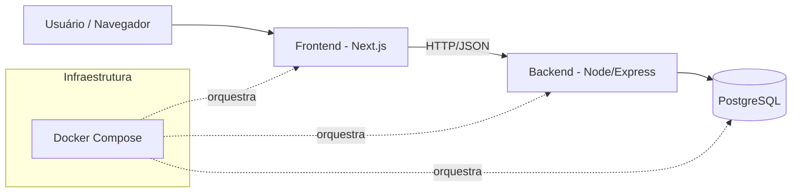
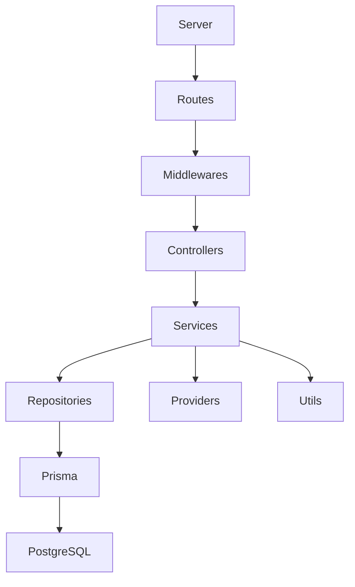
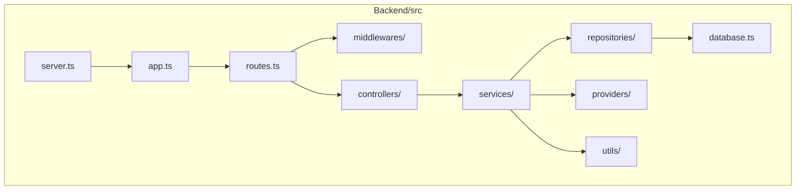
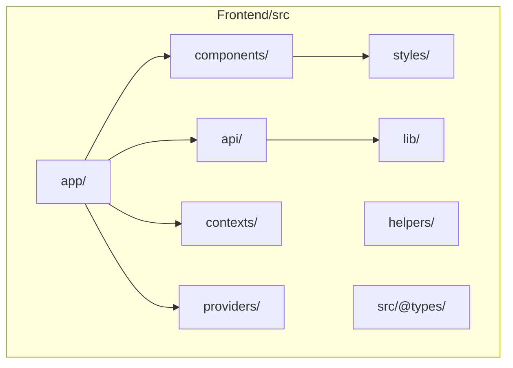
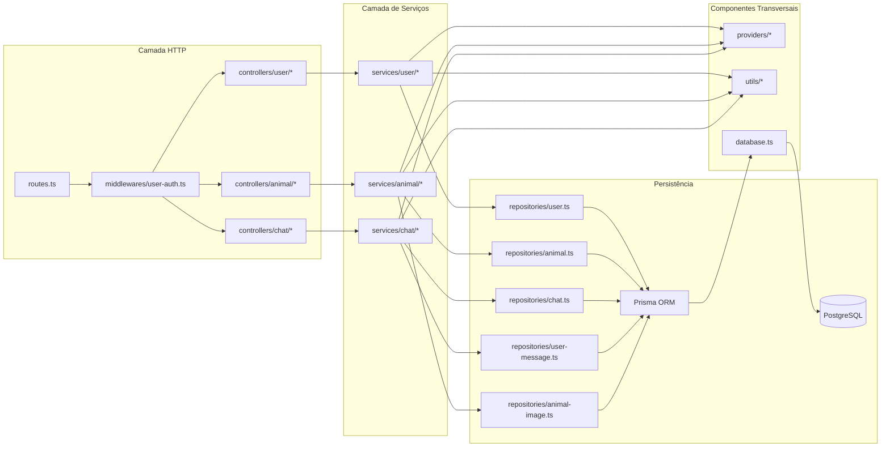

# Análise da Arquitetura do Sistema Adote Fácil

## 1. Visão Geral

O sistema Adote Fácil é estruturado em dois grandes blocos principais:

- **Frontend**: responsável pela interface com o usuário.
- **Backend**: responsável pela lógica de negócio, autenticação e acesso ao banco de dados.

A comunicação entre frontend e backend ocorre por meio de requisições HTTP, caracterizando um modelo **cliente-servidor**.

O projeto utiliza Docker para orquestração dos serviços e PostgreSQL como banco de dados.

---

## 2. Estilo Arquitetural Identificado

### 2.1 Arquitetura Cliente-Servidor

A separação explícita entre as pastas `frontend` e `backend` evidencia a adoção do modelo cliente-servidor:

- O **Frontend** atua como cliente.
- O **Backend** atua como servidor de aplicação.
- O banco de dados é executado como serviço separado (PostgreSQL).

Essa abordagem favorece escalabilidade, separação de responsabilidades e manutenção independente das camadas.

### 2.2 Arquitetura em Camadas (Backend)

O backend apresenta uma organização estruturada dentro da pasta `src`, com clara separação de responsabilidades:

- **routes.ts** → definição das rotas da aplicação.
- **controllers/** → recebem requisições HTTP e coordenam a execução das ações.
- **services/** → concentram as regras de negócio.
- **repositories/** → realizam acesso ao banco de dados.
- **prisma/** → ORM responsável pela comunicação com o PostgreSQL.
- **middlewares/** → interceptam requisições para autenticação e validação.
- **providers/** → implementações específicas como autenticação e criptografia.
- **utils/** → funções auxiliares reutilizáveis.
- **database.ts** → configuração de conexão com banco.
- **server.ts / app.ts** → inicialização da aplicação.

O fluxo típico de execução ocorre da seguinte forma:

1. Requisição chega ao servidor.
2. A rota correspondente é identificada.
3. O controller é acionado.
4. O service executa a regra de negócio.
5. O repository acessa o banco via Prisma.
6. A resposta é retornada ao cliente.

Essa organização caracteriza uma **arquitetura em camadas**, com forte separação entre controle, lógica de negócio e persistência.

### 2.3 Padrão Repository

A presença da pasta `repositories` indica a aplicação do **Repository Pattern**, cujo objetivo é abstrair o acesso ao banco de dados.

Isso reduz o acoplamento entre regras de negócio e persistência, facilitando testes e futuras mudanças de tecnologia de banco de dados.

## 3. Diagramas

### 3.1 Diagrama de Componentes do Sistema (Visão Geral)

Este diagrama representa a arquitetura cliente-servidor em alto nível, evidenciando a separação entre frontend, backend e banco de dados.

### 3.2 Diagrama de Componentes Internos do Backend (Camadas)

Este diagrama detalha a organização interna do backend, evidenciando o fluxo de tratamento de requisições e a separação em camadas.

### 3.3 Diagrama de Pacotes - Backend (Estrutura do Código)

### 3.4 Diagrama de Pacotes - Frontend (Estrutura do Código)

Esses diagramas de pacotes demonstram como a estrutura real do repositório está organizada, reforçando a separação de responsabilidades descrita anteriormente.

### 3.5 Diagrama de Componentes por Domínio (Backend)

Este diagrama complementa a visão por camadas com a visão por dominio (usuário, animal e chat), conectando os componentes reais existentes em `backend/src`. 

A combinação dos diagramas de componentes e pacotes permite visualizar tanto a organização lógica do sistema quanto sua estrutura física no repositório.